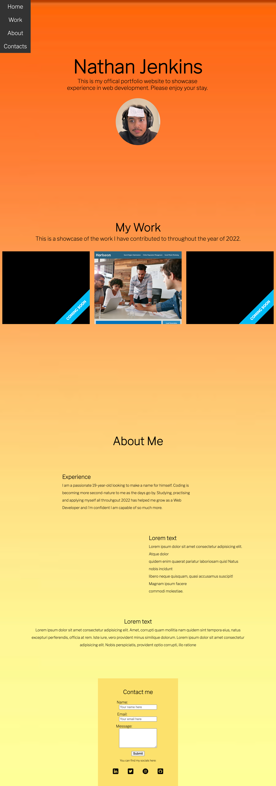

# First-Portfolio

## The first steps into my "offical portfolio"

This portfolio will outline the skills and attributes I will have as a web developer. My main motivation to build this website was to practise making a website and to give myself a basic outline for my future portfolio. I will be adding to this throughout my web development career. In this portfolio I have grasped a better understanding of how HTML and CSS works and I will continue to better my knowledge.

# 

### https://njenkins2727.github.io/Nathan-Portfolio/

